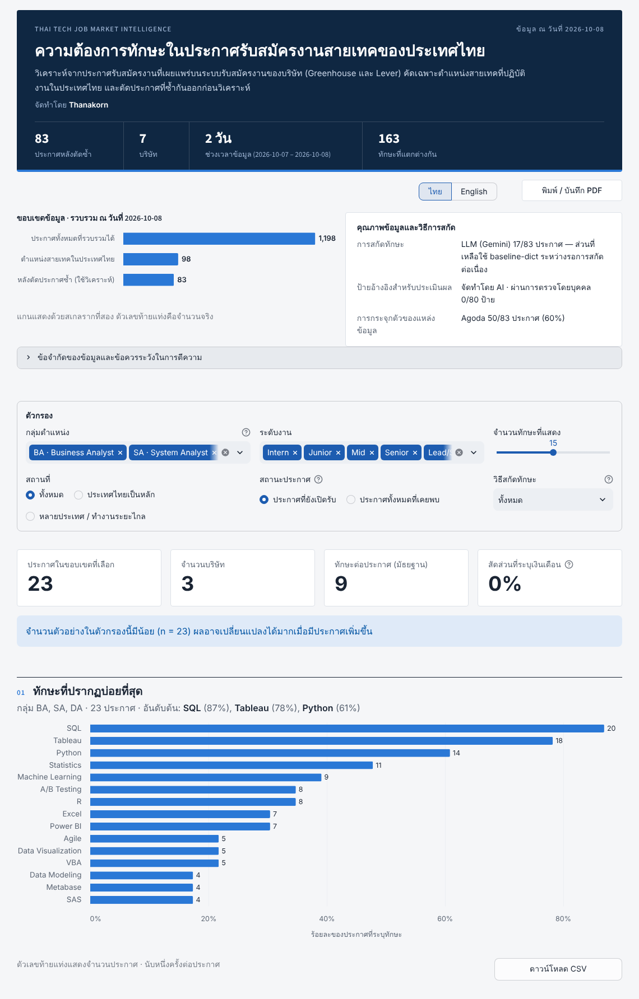

# Thai Tech Job Market Intelligence

**Live demo:** https://thai-tech-job-market-intelligence-4cdmmaq6qd8xgdk3lfgpt2.streamlit.app/

**ไทย** — ระบบเก็บและวิเคราะห์ประกาศรับสมัครงานสายเทคโนโลยีในประเทศไทยแบบรายวัน ดึงข้อมูลจาก API สาธารณะอย่างเป็นทางการของระบบรับสมัครงาน (Greenhouse, Lever) คัดเฉพาะตำแหน่งสายเทคในไทย ตัดประกาศซ้ำ สกัดทักษะ ระดับงาน และเงินเดือนด้วย LLM (Gemini) เทียบกับวิธีพจนานุกรม วัดความแม่นยำกับชุดทดสอบ แล้วแสดงผลบนแดชบอร์ดสองภาษา

**English** — A daily pipeline that collects tech job postings located in Thailand from the official public APIs of applicant-tracking systems (Greenhouse, Lever), filters and deduplicates them, extracts skills, seniority and salary with an LLM (Gemini) alongside a dictionary baseline, evaluates extraction accuracy against a test set, and presents the results in a bilingual (Thai/English) dashboard.



## สิ่งที่แดชบอร์ดตอบ · What the dashboard answers

| # | คำถาม · Question | ส่วนในแดชบอร์ด · Section |
|---|---|---|
| 1 | ตำแหน่ง BA / SA / DA ต้องการทักษะอะไรมากที่สุด · Most requested skills by role family | 01 |
| 2 | ทักษะต่างกันอย่างไรตามกลุ่มตำแหน่ง ระดับงาน และสถานที่ · Differences by role, seniority, location | 02 |
| 3 | ช่วงเงินเดือนตลาด และสัดส่วนประกาศที่ระบุเงินเดือน · Market salary ranges and salary disclosure | 03 |
| 4 | ความต้องการทักษะเปลี่ยนไปตามเวลาอย่างไร · Skill demand over time (after 14+ days of data) | 04 |
| 5 | ตัวสกัดแม่นยำแค่ไหน · Extraction accuracy | 05 |

ตัวเลขทุกตัวพร้อมวันที่และคำสั่งที่ใช้คำนวณอยู่ใน [`results.md`](results.md) · Every figure is logged with its date and command in `results.md`.

## วิธีรันบนเครื่อง · Run locally

**Windows (ดับเบิลคลิก)**
1. ติดตั้ง Python 3.10 ขึ้นไป (เลือก "Add python.exe to PATH")
2. ดับเบิลคลิก **`start.bat`** — ติดตั้งไลบรารีที่ขาด สร้างฐานข้อมูล แล้วเปิดแดชบอร์ดในเบราว์เซอร์ที่ http://127.0.0.1:8501 (ปิดหน้าต่างดำเพื่อหยุด)
3. (ไม่บังคับ) ดับเบิลคลิก **`setup_daily_task.bat`** เพื่อให้เก็บข้อมูลอัตโนมัติทุกวัน 09:07 ผ่าน Windows Task Scheduler
4. (ไม่บังคับ) คัดลอก `.env.example` เป็น `.env` แล้วใส่ Gemini API key (ฟรีที่ https://aistudio.google.com/apikey) เพื่อสกัดด้วย LLM

**Any OS (command line)**
```bash
python -m venv .venv
source .venv/bin/activate          # Windows: .venv\Scripts\activate
pip install -r requirements.txt
streamlit run app.py               # ใช้ข้อมูลตัวอย่างใน data/snapshot/ · uses the bundled snapshot
```

ท่อข้อมูลเต็ม · Full pipeline (needs internet access to the ATS APIs):
```bash
python -m src.collect && python -m src.stage && python -m src.dedupe
python -m src.baseline          # dictionary baseline
python -m src.extract           # Gemini (requires GEMINI_API_KEY in .env)
python -m src.marts             # build data/marts/jobs.duckdb
python -m src.snapshot          # export data/snapshot/ for the online demo
python -m pytest -q             # run the test suite
```

แดชบอร์ดอ่าน `data/marts/jobs.duckdb` ถ้ามี ไม่เช่นนั้นอ่าน `data/snapshot/*.parquet` (ไม่เขียนไฟล์ใด ๆ ระหว่างทำงาน) · The app reads the local DuckDB file when present, otherwise the Parquet snapshot, and never writes to disk.

## สถาปัตยกรรม · Architecture

```
Greenhouse / Lever API ─► raw (JSON ต้นฉบับ ไม่แก้ไข) ─► staging (normalize, กรองไทย + สายเทค, job_id คงที่)
                                                      └► dedupe ─► extract (Gemini) / baseline (dictionary + rules)
                                                                └► marts (DuckDB) ─► snapshot (Parquet) ─► Streamlit
```

| ชั้น · Layer | ไฟล์ · Files | หมายเหตุ · Notes |
|---|---|---|
| raw | `data/raw/<date>/` | ต้นฉบับรายวัน ไม่เขียนทับ · immutable daily snapshots (not in git) |
| staging | `data/staging/` | ประกาศที่กรองแล้ว และกลุ่มประกาศซ้ำ · filtered postings and duplicate groups (not in git) |
| extracted | `data/extracted/extractions.jsonl` | cache ต่อ (job_id, model, prompt version) · per-posting cache (not in git) |
| marts | `data/marts/jobs.duckdb` | ตารางสำหรับแดชบอร์ด · dashboard tables (not in git) |
| snapshot | `data/snapshot/*.parquet` | สำเนาสำหรับเว็บออนไลน์ ลบอีเมล/เบอร์โทรออก · copy for the online demo, emails/phone numbers removed |
| evaluation | `data/gold/labels.jsonl`, `data/eval/` | ป้ายอ้างอิงและผลวัด · reference labels and evaluation results |

กฎการกรอง จัดกลุ่มตำแหน่ง และพจนานุกรมทักษะอยู่ใน `config/` · Filtering rules, role-family rules and the skill dictionary live in `config/`.

## การวัดผล · Evaluation

- ชุดทดสอบ 80 ประกาศ แบ่ง dev 30 / test 50 แบบสุ่มคงที่ · 80 postings split into fixed dev (30) / test (50) sets
- ตัวชี้วัด: precision / recall / F1 ของทักษะ และ accuracy ของระดับงานและกลุ่มตำแหน่ง · Skill precision/recall/F1, seniority and role-family accuracy
- ป้ายอ้างอิงสร้างด้วย LLM อีกตัว (คนละโมเดลกับตัวสกัด) และยังไม่ผ่านการตรวจโดยบุคคล ตรวจทานได้ด้วย `run_label.bat` · Reference labels were generated by a different LLM and have not yet been human-verified; review them with `run_label.bat`
- ผลของ baseline เป็นค่าขอบเขตบน เพราะพจนานุกรมถูกปรับระหว่างดูประกาศชุดเดียวกัน · Baseline scores are an upper bound because the dictionary was tuned on the same postings

## ข้อจำกัด · Limitations

**ไทย**
- เป็นประกาศจากระบบรับสมัครงานของบริษัทที่รวบรวมได้ ไม่ใช่ภาพรวมตลาดแรงงานไทย บริษัทส่วนใหญ่เป็นองค์กรขนาดใหญ่หรือต่างชาติ ประกาศเกือบทั้งหมดเป็นภาษาอังกฤษ และบริษัทเดียว (Agoda) มีสัดส่วนราว 60% ของประกาศ
- เว็บหางานไทยที่มีประกาศจำนวนมาก (JobsDB, JobThai, LinkedIn, Indeed) ห้ามหรือไม่อนุญาตชัดเจนเรื่องการเก็บข้อมูลอัตโนมัติ จึงไม่ได้ใช้ (ดู [`SOURCES.md`](SOURCES.md))
- ประกาศกลุ่มนี้แทบไม่ระบุเงินเดือน ช่วงเงินเดือนในแดชบอร์ดจึงมาจากแหล่งสำรวจภายนอก (Adecco Thailand Salary Guide) และแสดงแยกจากข้อมูลประกาศ
- Gemini ฟรีเทียร์จำกัดโควตาต่อวัน การสกัดด้วย LLM จึงทยอยทำรายวัน ระหว่างนั้นใช้ผลจากพจนานุกรม
- การเก็บรายวันทำงานเมื่อเครื่องเปิดและเข้าสู่ระบบอยู่ เว็บออนไลน์แสดงข้อมูล ณ วันที่อัปเดต snapshot ล่าสุด
- แนวโน้มต้องใช้ข้อมูลอย่างน้อย 14 วัน

**English**
- Postings come from company applicant-tracking systems only; this is not a view of the whole Thai labour market. Most employers are large or multinational, nearly all postings are in English, and one company (Agoda) accounts for about 60% of them.
- Major Thai job boards (JobsDB, JobThai, LinkedIn, Indeed) prohibit or do not clearly permit automated collection and are not used (see `SOURCES.md`).
- Salaries are rarely stated in these postings; the salary ranges shown come from an external survey (Adecco Thailand Salary Guide) and are displayed separately.
- The Gemini free tier has a daily quota, so LLM extraction progresses gradually; the dictionary baseline fills the gap meanwhile.
- Daily collection runs only while the host computer is on and logged in; the online demo shows data as of the latest snapshot.
- Trends require at least 14 days of data.

## อัปเดตเว็บออนไลน์ · Updating the online demo

`run_daily.bat` สร้าง `data/snapshot/` ใหม่ทุกวัน แล้วเรียก `publish.bat` เพื่อ commit และ push ข้อมูลชุดนี้ขึ้น GitHub เอง (Streamlit Community Cloud โหลดข้อมูลใหม่อัตโนมัติ) ใช้ Git ที่มากับ GitHub Desktop (หรือ Git for Windows) และต้องดับเบิลคลิก `publish.bat` หนึ่งครั้งเพื่อเข้าสู่ระบบ GitHub · `run_daily.bat` refreshes `data/snapshot/` and calls `publish.bat` to commit and push it; uses the Git bundled with GitHub Desktop (or Git for Windows) and needs a one-time sign-in by running `publish.bat` manually.

## แหล่งข้อมูลและแนวปฏิบัติ · Data sources and practice

เก็บวันละครั้ง หน่วง 2 วินาทีต่อคำขอ ระบุตัวตนผ่าน User-Agent ไม่เรียก endpoint สำหรับการสมัครงาน และไม่เก็บข้อมูลส่วนบุคคล รายละเอียดการตรวจเงื่อนไขของแต่ละแหล่งอยู่ใน [`SOURCES.md`](SOURCES.md) · Collected once per day with a 2-second delay per request and an identifying User-Agent; no application endpoints are called and no personal data is stored.

## โครงสร้างโปรเจกต์ · Project structure
```

app.py                  Streamlit dashboard (Thai / English)
src/                    pipeline modules (collect, stage, dedupe, extract, baseline, evaluate, marts, snapshot, ...)
config/                 sources, filters, role-family rules, skill dictionary, salary reference, site settings
data/snapshot/          Parquet snapshot used by the online demo
data/gold/, data/eval/  reference labels and evaluation results
tests/                  pytest suite
docs/                   labelling guide and screenshot
*.bat                   Windows one-click scripts (start, daily run, scheduler setup, labelling)
```
